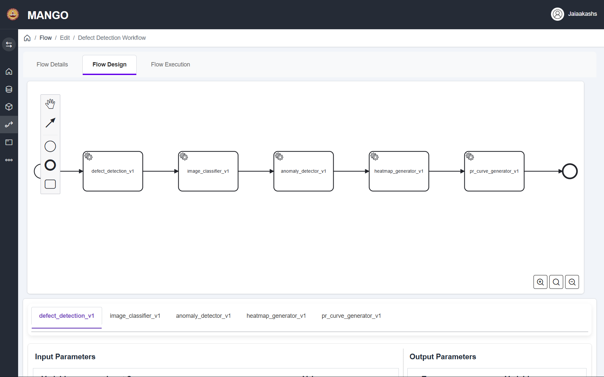
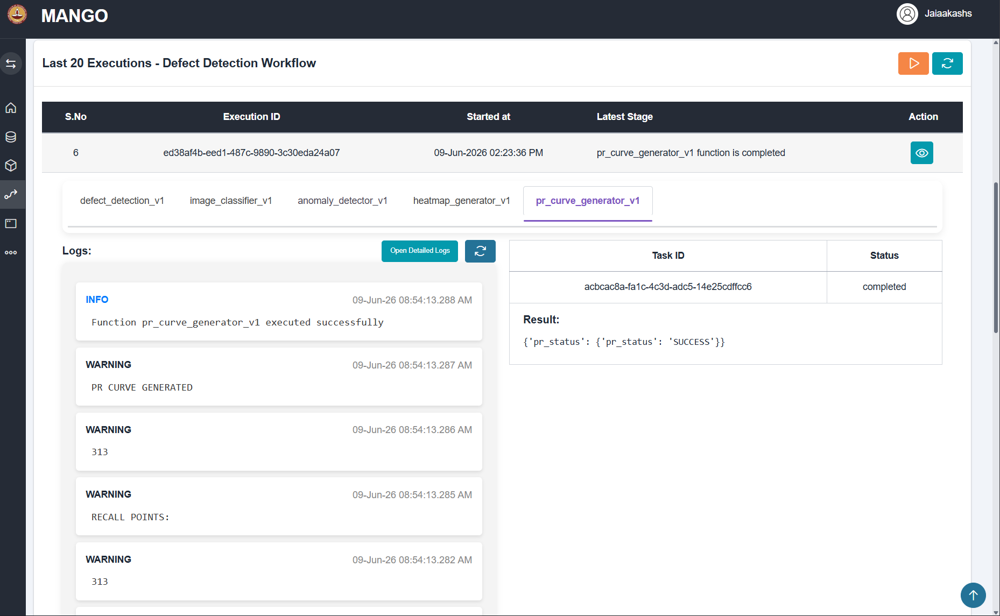
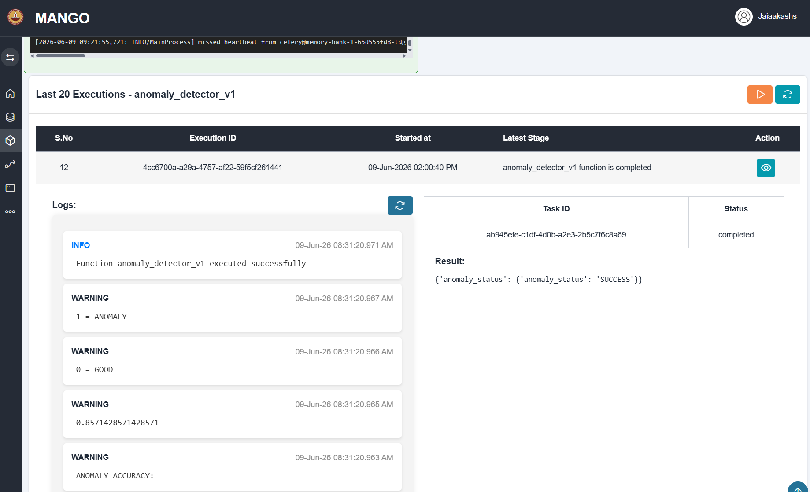
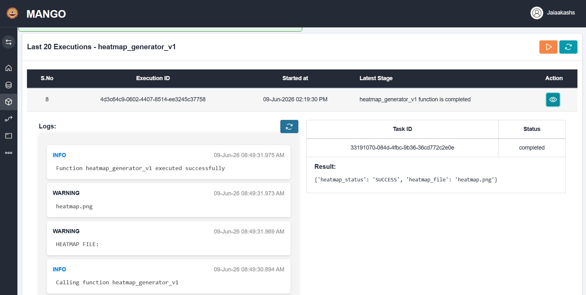
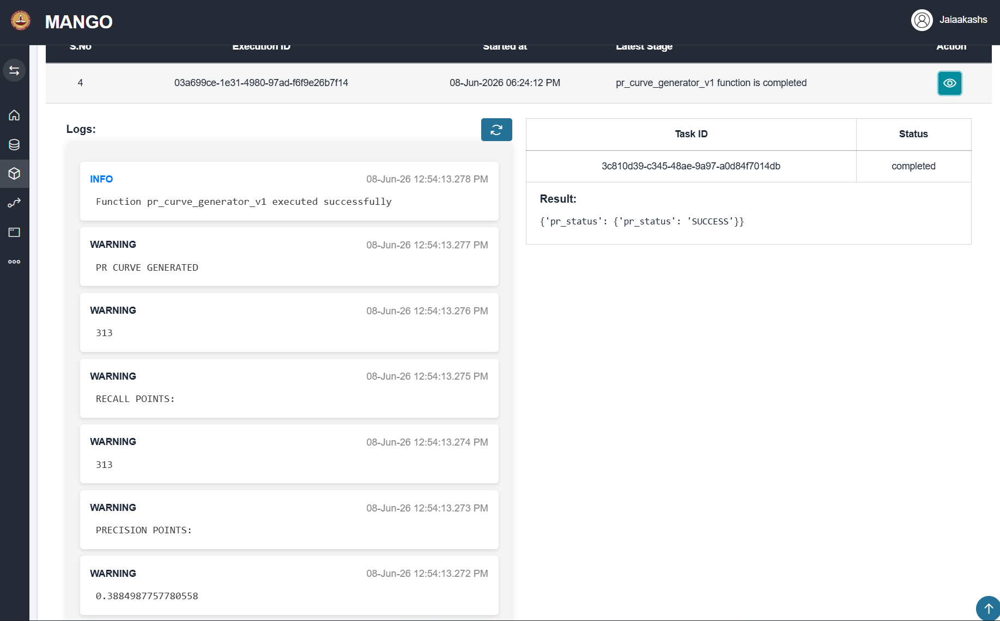

# Industrial Defect Detection & Anomaly Analysis Workflow

## Overview

This project implements an end-to-end computer vision workflow for industrial defect inspection using the MANGO Workflow Platform.

The system processes industrial component images, classifies product views, detects anomalies, generates heatmaps, and evaluates model performance using Precision-Recall analysis.

---

## Workflow Architecture

Defect Detection

↓

Image Classification

↓

Anomaly Detection

↓

Heatmap Generation

↓

PR Curve Generation

---

## Features

### Defect Detection

* Validates and processes industrial image datasets.
* Organizes and prepares images for further analysis.

### Image Classification

* Classifies images into:

  * Bottom View
  * Side View
  * Top View

### Anomaly Detection

* Extracts image features using ResNet18.
* Uses Random Forest Classifier for anomaly detection.
* Distinguishes between:

  * Good Products
  * Defective Products

### Heatmap Generation

* Generates visual heatmap representations from image data.
* Supports inspection and visualization of image regions.

### Precision-Recall Analysis

* Computes Precision-Recall metrics.
* Calculates PR-AUC score.
* Supports model performance evaluation.

---

## Technology Stack

* Python
* PyTorch
* Torchvision
* Scikit-learn
* NumPy
* PIL (Python Imaging Library)
* Matplotlib
* MANGO Workflow Platform

---

## Dataset Structure

Dataset/

├── train/

│   ├── bottom/

│   ├── side/

│   └── top/

│

└── test/

```
├── bottom/

│   ├── good/

│   └── anomaly/

│

├── side/

│   ├── good/

│   └── anomaly/

│

└── top/

    ├── good/

    └── anomaly/
```

---

## Machine Learning Pipeline

### Feature Extraction

* ResNet18 pretrained backbone
* Deep feature representation extraction

### Classification

* Random Forest Classifier
* Multi-class image classification

### Anomaly Detection

* Good vs Anomaly prediction
* Evaluation using validation accuracy

---

## Workflow Screenshots

### Workflow Design



### Workflow Execution



### Anomaly Detection Results



### Heatmap Generation



### PR Curve Generation



---

## Results

* Successful end-to-end workflow execution
* Automated image classification
* Automated anomaly detection
* Heatmap generation
* Precision-Recall evaluation
* Industrial inspection workflow deployment

---

## Future Improvements

* Grad-CAM based visual explanations
* Real-time image inference
* Web dashboard integration
* Deep learning based anomaly localization
* Advanced defect segmentation

---

## Author

**Jai Aakash**

Computer Science Engineering Student

Backend Development | Machine Learning | Computer Vision | Workflow Automation

GitHub: https://github.com/JaiAakash21
LinkedIn: www.linkedin.com/in/jaiaakash21
